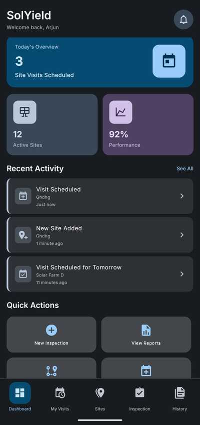
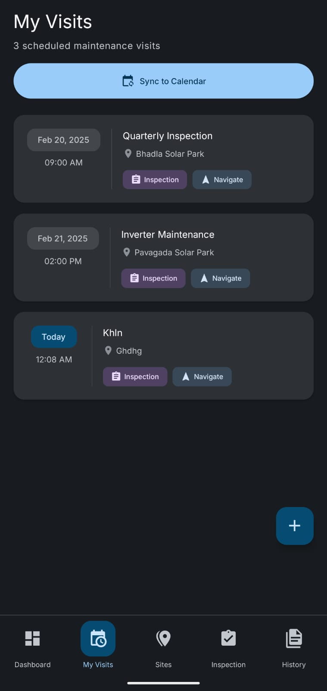
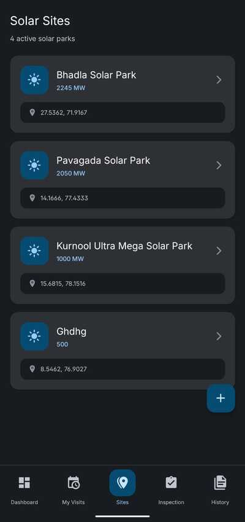
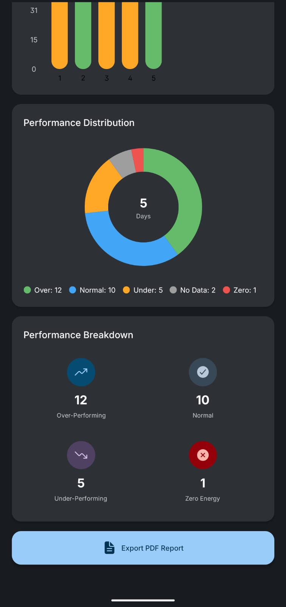
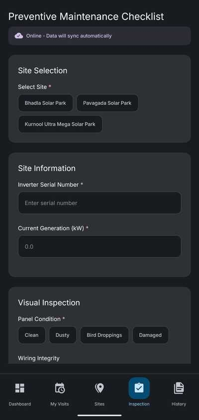

# SolYield Mobile - Solar Farm Management Application

## Project Overview

SolYield Mobile is a production-ready React Native mobile application designed for solar field technicians to manage site visits, perform inspections, generate performance reports, and operate effectively in offline environments. The application implements Material You design language with dynamic color theming and follows an offline-first architecture.

This project was developed as a comprehensive solution for the SolYield Mobile Migration Hackathon, implementing all requirements from Level 1 (Connected Technician) and Level 2 (Offline Warrior) specifications while incorporating Material 3 Expressive design principles.

## Technical Stack

| Category | Technology |
|----------|-----------|
| Framework | React Native with Expo SDK 54 |
| Language | TypeScript (Strict Mode) |
| State Management | Redux Toolkit with Redux Persist |
| Navigation | Expo Router (File-based routing) |
| UI Framework | Material 3 Expressive + Material You + NativeWind (Tailwind CSS) |
| Offline Database | WatermelonDB |
| Maps | Modular Map System (API-key-free with react-native-maps ready) |
| Charts | react-native-gifted-charts |
| PDF Generation | expo-print |
| Calendar | expo-calendar |
| Location Services | expo-location |
| Camera | expo-camera |

## Architecture Principles

The application follows strict modular architecture principles:

1. **Separation of Concerns**: UI components are isolated from business logic
2. **Single Responsibility**: Each module serves one clear purpose
3. **Dependency Direction**: UI depends on business logic, not vice versa
4. **Pure Functions**: Utilities are stateless and fully testable
5. **Hook Abstraction**: Redux complexity hidden behind custom hooks
6. **Offline-First**: All data operations work without network connectivity

### Layer Architecture

```
┌─────────────────────────────────────────┐
│          UI Layer (Presentation)        │
│  - Components (React)                   │
│  - Screens (Pages)                      │
│  - Styling (M3 Tokens)                  │
└─────────────────┬───────────────────────┘
                  │ uses
┌─────────────────▼───────────────────────┐
│         Business Logic Layer            │
│  - Custom Hooks (useActivityManager)    │
│  - Utility Functions (activityUtils)    │
│  - Type Definitions                     │
└─────────────────┬───────────────────────┘
                  │ uses
┌─────────────────▼───────────────────────┐
│          Data Layer (State)             │
│  - Redux Store                          │
│  - Redux Slices (activitySlice)         │
│  - Selectors                            │
└─────────────────────────────────────────┘
```

## Core Features

### Level 1: The Connected Technician

#### 1. My Visits (Schedule & Calendar)

- Display scheduled maintenance visits with date, time, and site information
- Calendar synchronization using `expo-calendar` for native device integration
- Custom M3DatePicker and M3TimePicker components with Material You theming
- Requiem visit support (memorial/special visits without site assignment)
- Schedule conflict validation with 5-minute buffer
- Form state preservation with AsyncStorage auto-save
- Pull-to-refresh functionality and empty state handling
- Floating action button for adding new visits

**Key Files**:
- `app/(tabs)/schedule.tsx` - Schedule screen with calendar sync
- `app/add-visit.tsx` - Add visit form with custom pickers
- `app/components/M3DatePicker.tsx` - Calendar grid date picker
- `app/components/M3TimePicker.tsx` - Hour/minute wheel time picker

#### 2. "I'm Here!" (Geofencing & Check-in/Check-out)

**Check-in System:**
- Real-time GPS tracking with `expo-location`
- Distance calculation from current location to site coordinates using Haversine formula
- 500-meter radius geofencing validation
- Check-in only works when within geofence radius
- Links check-in to scheduled visits automatically
- Creates Activity record for tracking
- Updates Schedule with check-in timestamp and activity ID

**Check-out System:**
- Check-out button replaces check-in button when user is checked in
- Calculates actual visit duration from check-in to check-out time
- Displays duration in format: "Xh Ym" (e.g., "2h 15m")
- Marks visit as completed in database
- Triggers archival workflow after check-out

**Archival Workflow:**
After check-out, the system presents two sequential dialogs:
1. **Archive This Visit?** - User can choose to archive the completed visit or keep it active
2. **Archive This Site?** - Only shown if no future scheduled visits exist for the site

**Database Schema:**
- `schedules.checked_in_at` - Timestamp when user checked in
- `schedules.checked_out_at` - Timestamp when user checked out
- `schedules.actual_duration_minutes` - Calculated visit duration
- `schedules.activity_id` - Links to Activity record created during check-in

**Key Files**:
- `app/site/[id].tsx` - Site detail with full check-in/check-out flow (lines 161-405)
- `lib/hooks/useGeofencing.ts` - Geofencing validation and activity creation
- `lib/hooks/useActivities.ts` - Activity management with ID generation
- `database/models/Schedule.ts` - Schedule model with check-in/out methods (lines 66-97)
- `database/schema.ts` - Database schema version 4 with check-in/out fields
- `database/migrations.ts` - Migration from v3 to v4 (lines 86-126)

#### 3. Site Maps (Modular Implementation)

- API-key-free map visualization using custom `MiniMapPreview` component
- Modular architecture ready for react-native-maps integration
- Grid-based stylized map rendering with deterministic pin positioning
- Mini map previews in sites list for enhanced UX
- Deep-link integration with Google Maps/Apple Maps for external navigation
- Geofence radius visualization
- Full Material You theming support

**Key Files**:
- `app/components/maps/MiniMapPreview.tsx` - API-key-free map component
- `app/components/maps/SiteMapWidget.tsx` - Modular wrapper with feature flag
- `app/components/maps/NativeMapView.tsx` - Future react-native-maps wrapper
- `lib/config/maps.ts` - Configuration for map implementation switching

**Modular Map System Architecture**:

The map system uses a three-layer approach:

```
┌─────────────────────────────────────────┐
│      Application Layer                  │
│  (Site Detail, Navigation, Sites List)  │
└──────────────┬──────────────────────────┘
               │
               ↓
┌─────────────────────────────────────────┐
│      SiteMapWidget                      │
│  (Modular Wrapper with Feature Flag)    │
└──────────────┬──────────────────────────┘
               │
          ┌────┴────┐
          ↓         ↓
┌─────────────┐  ┌──────────────┐
│MiniMapPreview│  │NativeMapView │
│  (Default)   │  │  (Future)    │
└─────────────┘  └──────────────┘
```

Benefits:
- Zero crashes: App works without any API keys
- Modular: Easy to swap to react-native-maps by setting environment variable
- Enhanced UX: Activity cards show rich context with inline maps
- Consistent: All map surfaces use same widget interface
- Future-ready: NativeMapView wrapper ready for real maps integration

#### 4. The Report Card (PDF & Charts)

- Bar Chart: Daily energy generation with month navigation (react-native-gifted-charts)
- Pie Chart: Performance distribution (Over/Normal/Under/Zero performance)
- Stats cards showing Average, Peak, and Total generation metrics
- PDF export functionality using `expo-print`
- Share/save PDF reports with `expo-sharing`
- Dynamic data visualization with smooth animations

**Key Files**:
- `app/performance.tsx` - Analytics screen with charts and PDF export
- `lib/utils/chartHelpers.ts` - Chart data transformation utilities

### Level 2: The Offline Warrior

#### 1. The Black Box (Persistence)

- Redux Persist with AsyncStorage for offline data storage
- WatermelonDB integration for structured data persistence
- Database schema version 4 with check-in/check-out tracking
- Inspection forms persist across app restarts
- Automatic state rehydration on app launch
- Schedule and site data stored locally with archival support
- Activity logging with sync status tracking

**Archival System:**
The application includes intelligent archival logic to keep the interface clean:

- **Visit Archival**: After checking out from a site, users can archive completed visits
- **Site Archival**: Sites can be archived when no future scheduled visits exist
- **Cascade Archival**: When a site is archived, all related data is archived:
  - All activities linked to the site
  - All schedules for the site
  - All maintenance forms for the site
  - Performance records (preserved for historical analytics)
- **Filtered Queries**: Archived sites and visits are automatically filtered from default queries
- **View Archived**: Separate hooks available (`useArchivedSites()`) for viewing archived data

**Archive Database Fields:**
- `sites.archived` (boolean) - Marks site as archived
- `sites.archivedAt` (timestamp) - When site was archived
- `schedules.archived` (boolean) - Marks visit as archived
- `activities.archived` (boolean) - Marks activity as archived
- `maintenance_forms.archived` (boolean) - Marks form as archived

**Key Files**:
- `store/index.ts` - Redux store configuration with persistence
- `database/schema.ts` - WatermelonDB schema definitions (version 4)
- `database/migrations.ts` - Database migration v3 → v4
- `database/models/Site.ts` - Site model with archive() method (lines 81-134)
- `database/models/Schedule.ts` - Schedule model with archival support
- `lib/hooks/useSites.ts` - Site queries with archive filtering (lines 41-89)
- `app/site/[id].tsx` - Archive workflow implementation (lines 335-405)

#### 2. Dynamic Form Engine

- Schema-driven form rendering from `form_schema.js`
- Support for multiple field types:
  - Text inputs with validation
  - Number inputs with min/max constraints
  - Dropdown selects with dynamic options
  - Radio buttons for single selection
  - Checkboxes for multiple selection
  - File uploads (camera capture and gallery picker)
- Real-time form validation with error messages
- Conditional field rendering based on rules

**Key Files**:
- `app/(tabs)/inspection.tsx` - Dynamic form renderer
- `app/components/FormField.tsx` - Generic form field component
- `form_schema.js` - Form schema definition

#### 3. Visual Evidence

- Camera integration using `expo-camera` for site photos
- Image picker for gallery uploads via `expo-image-picker`
- Image preview and removal functionality
- Images stored as local URIs in WatermelonDB
- Multiple image upload support per form
- Thumbnail generation for efficient display

**Key Files**:
- `app/(tabs)/inspection.tsx` - Image capture implementation (lines 120-180)
- `store/slices/maintenanceSlice.ts` - Image storage in Redux

#### 4. Sync-on-Reconnect

- Network status detection using `@react-native-community/netinfo`
- Online/Offline status banner in inspection form
- Automatic sync indicator (cloud-check/cloud-upload icons)
- Manual refresh capability in history view
- Sync queue management for pending submissions
- Retry logic for failed sync operations

**Key Files**:
- `lib/hooks/useNetworkStatus.ts` - Network monitoring hook
- `store/slices/activitySlice.ts` - Sync status management

### Material 3 Expressive Design

#### Material You Dynamic Colors

- Full dynamic color extraction using `react-native-material-you-colors`
- Wallpaper-based color palette generation (Android 12+)
- Pastel-leaning color scheme for accessibility and reduced eye strain
- Light and Dark mode support with automatic system theme detection
- Fallback to green energy palette for iOS and Android versions below 12
- JIT (Just-In-Time) color processing to avoid blocking UI thread

**Key Files**:
- `lib/hooks/MaterialYouProvider.tsx` - Global color provider
- `lib/hooks/useMaterialYou.ts` - Color extraction hook
- `lib/design/colorRoles.ts` - Semantic color mapping

**Material You Color System**:

The hexa-tone system uses 6 primary color surfaces:

1. **Background** (from wallpaper) - Main app background dynamically sourced from device wallpaper
2. **Surface Containers** (5 elevation levels) - Cards at different elevation states
3. **Primary Accent** (interactive elements) - Primary buttons, FABs, active tab states
4. **Secondary Accent** (supporting elements) - Secondary buttons, toggles
5. **Tertiary Accent** (variety and success states) - Tertiary buttons, chips
6. **Text/Icons** (adaptive based on surface) - High/medium/low emphasis text and icons

**Usage**:

```typescript
import { useMaterialYouColors } from '../../lib/hooks/MaterialYouProvider';

function MyComponent() {
  const colors = useMaterialYouColors();

  return (
    <View style={{ backgroundColor: colors.appBackground }}>
      <View style={{ backgroundColor: colors.surfaceBase }}>
        <Text style={{ color: colors.textPrimary }}>Hello</Text>
      </View>
    </View>
  );
}
```

#### M3 Design Tokens

- Typography system (Display, Headline, Title, Body, Label variants)
- Elevation system (Level 0-5 with Material shadows)
- Shape system (Rounded corner specifications)
- Motion system (Duration and easing functions)
- Spacing system (Consistent padding/margin scale)

**Key Files**:
- `lib/design/tokens.ts` - M3 design token definitions
- `lib/styles/m3.ts` - StyleSheet-based M3 implementations

#### Custom M3 Components

- M3DatePicker: Calendar grid with month/year navigation
- M3TimePicker: Hour/minute wheel picker with AM/PM toggle
- M3ErrorDialog: Validation dialog (error/warning/info/success types)
- M3AlertDialog: Generic alert dialog
- M3ConfirmDialog: Multi-button confirmation dialog
- ActivityCard: Activity display with Material You theming
- StyledText: Typography component with M3 variants

**Key Files**:
- `app/components/M3DatePicker.tsx`
- `app/components/M3TimePicker.tsx`
- `app/components/M3ErrorDialog.tsx`
- `app/components/M3AlertDialog.tsx`
- `app/components/M3ConfirmDialog.tsx`
- `app/components/ActivityCard.tsx`
- `app/components/StyledText.tsx`

## Project Structure

```
SolYield/
├── app/                              # Expo Router pages
│   ├── (tabs)/                       # Bottom tab navigation
│   │   ├── index.tsx                 # Dashboard/Home screen
│   │   ├── schedule.tsx              # My Visits schedule
│   │   ├── sites.tsx                 # Solar Sites list
│   │   ├── inspections.tsx           # Inspections list
│   │   └── _layout.tsx               # Tab bar layout
│   ├── components/                   # Reusable UI components
│   │   ├── maps/                     # Modular map system
│   │   │   ├── MiniMapPreview.tsx    # API-key-free map
│   │   │   ├── SiteMapWidget.tsx     # Modular wrapper
│   │   │   └── NativeMapView.tsx     # Future native maps
│   │   ├── M3DatePicker.tsx          # Material date picker
│   │   ├── M3TimePicker.tsx          # Material time picker
│   │   ├── M3ErrorDialog.tsx         # Material error dialog
│   │   ├── ActivityCard.tsx          # Activity display card
│   │   └── StyledText.tsx            # Typography wrapper
│   ├── site/[id].tsx                 # Site details (dynamic route)
│   ├── inspection/[id].tsx           # Inspection detail view
│   ├── performance.tsx               # Charts & PDF export
│   ├── map-navigation.tsx            # GPS navigation screen
│   ├── add-visit.tsx                 # Add visit form
│   ├── add-site.tsx                  # Add site form
│   └── _layout.tsx                   # Root layout
├── store/                            # Redux Toolkit store
│   ├── slices/                       # Feature slices
│   │   ├── activitySlice.ts          # Activity logging
│   │   ├── maintenanceSlice.ts       # Maintenance forms
│   │   └── siteSlice.ts              # Site data
│   └── index.ts                      # Store configuration
├── database/                         # WatermelonDB
│   ├── models/                       # Data models
│   │   ├── Site.ts                   # Site model
│   │   ├── Schedule.ts               # Schedule model
│   │   ├── Activity.ts               # Activity model
│   │   └── MaintenanceForm.ts        # Maintenance form model
│   ├── schema.ts                     # Database schema
│   └── index.ts                      # Database configuration
├── lib/                              # Business logic & utilities
│   ├── hooks/                        # Custom React hooks
│   │   ├── MaterialYouProvider.tsx   # Color theme provider
│   │   ├── useMaterialYou.ts         # Color extraction
│   │   ├── useSchedules.ts           # Schedule management
│   │   ├── useSiteManagement.ts      # Site CRUD operations
│   │   ├── useDBActivities.ts        # Activity queries
│   │   └── usePerformanceData.ts     # Performance analytics
│   ├── utils/                        # Utility functions
│   │   ├── activityUtils.ts          # Activity helpers
│   │   ├── dateFormatter.ts          # Date formatting
│   │   ├── locationUtils.ts          # Location calculations
│   │   ├── chartHelpers.ts           # Chart data transformation
│   │   └── scheduleValidation.ts     # Conflict validation
│   ├── design/                       # Design system
│   │   ├── tokens.ts                 # M3 design tokens
│   │   ├── colorRoles.ts             # Semantic colors
│   │   └── staticColors.ts           # PDF export colors
│   └── config/                       # Configuration
│       └── maps.ts                   # Map system config
├── assets/                           # Images & icons
├── form_schema.js                    # Dynamic form schema
├── schedule.js                       # Sample schedule data
├── sites.js                          # Sample site data
├── chart_data.js                     # Sample chart data
├── performance_data.js               # Sample performance data
└── package.json                      # Dependencies
```

## Installation & Setup

### Prerequisites

- Node.js 18 or higher
- npm or yarn package manager
- Expo CLI
- Android Studio (for Android development)
- Xcode (for iOS development, macOS only)
- Physical Android 12+ device (recommended for Material You testing)

### Installation Steps

```bash
# Clone the repository
git clone <repository-url>
cd Sol/SolYield

# Install dependencies
npm install

# Start development server
npm start

# Run on Android (requires connected device or emulator)
npm run android

# Run on iOS (requires macOS and Xcode)
npm run ios

# Alternative: Use Expo CLI directly
npx expo run:android
npx expo run:ios
```

### Environment Configuration

The application works out-of-the-box without any API keys. To enable native maps in the future:

1. Set environment variable in `.env`:
```env
EXPO_PUBLIC_ENABLE_NATIVE_MAPS=true
```

2. Add Google Maps API key to `app.json`:
```json
{
  "android": {
    "config": {
      "googleMaps": {
        "apiKey": "YOUR_GOOGLE_MAPS_API_KEY"
      }
    }
  }
}
```


## Development Commands

```bash
# Start development server
npm start

# Run on Android device/emulator
npm run android

# Run on iOS device/simulator (macOS only)
npm run ios

# Run TypeScript type checking
npm run type-check

# Run ESLint
npm run lint

# Run Prettier formatter
npm run format

# Clear cache and restart
npm start --clear
```

## Production Build & Deployment

### Prerequisites for Production Builds

1. **Install EAS CLI globally:**
```bash
npm install -g eas-cli
```

2. **Login to Expo account:**
```bash
eas login
```

3. **Configure project (first time only):**
```bash
eas build:configure
```

### Building for Production

#### Option 1: EAS Build (Recommended - Cloud-Based)

EAS Build compiles your app in the cloud without requiring local Android Studio or Xcode setup.

**Build APK for Android:**
```bash
npm run build:android
# or directly:
eas build --platform android --profile production
```

**Build for iOS:**
```bash
npm run build:ios
# or directly:
eas build --platform ios --profile production
```

**Build for Both Platforms:**
```bash
npm run build:all
# or directly:
eas build --platform all --profile production
```

**Check Build Status:**
```bash
eas build:list
```

**Download Build:**
After build completes, EAS will provide a download link. You can also download from:
```bash
eas build:view <build-id>
```

#### Option 2: Local Build (Requires Android Studio/Xcode)

**Android Release APK (Local):**
```bash
npm run android:build
# This runs: cd android && ./gradlew clean && ./gradlew assembleRelease
# Output: android/app/build/outputs/apk/release/app-release.apk
```

**Android Release AAB (Local - for Google Play):**
```bash
npm run android:bundle
# This runs: cd android && ./gradlew clean && ./gradlew bundleRelease
# Output: android/app/build/outputs/bundle/release/app-release.aab
```

**iOS Release (Local - macOS only):**
```bash
npm run ios:release
# This runs: expo run:ios --configuration Release
```

### Build Profiles (Configured in eas.json)

The project includes three build profiles:

1. **development**: Development client with fast refresh
   - Output: APK (Android)
   - Distribution: Internal testing

2. **preview**: Pre-production testing build
   - Output: APK (Android)
   - Distribution: Internal testing

3. **production**: Final production build
   - Output: APK (Android) or AAB (for Google Play)
   - Environment: NODE_ENV=production
   - Console logs automatically removed via metro.config.js

### Converting AAB to APK

Google Play Store requires AAB (Android App Bundle) format, but for direct distribution you may need APK. Here's how to convert:

#### Method 1: Using bundletool (Official Google Tool)

**1. Download bundletool:**
```bash
wget https://github.com/google/bundletool/releases/latest/download/bundletool-all-1.15.6.jar
# Or download manually from: https://github.com/google/bundletool/releases
```

**2. Generate APKs from AAB:**
```bash
java -jar bundletool-all-1.15.6.jar build-apks \
  --bundle=app-release.aab \
  --output=app-release.apks \
  --mode=universal
```

**3. Extract Universal APK:**
```bash
unzip app-release.apks -d output/
# The universal APK will be in: output/universal.apk
```

**4. Rename and use:**
```bash
mv output/universal.apk SolYield-v1.3.0.apk
```

#### Method 2: Using bundletool with Device Signature (Recommended for Testing)

**1. Generate signed APKs for a specific device:**
```bash
# Create debug keystore if you don't have one
keytool -genkey -v -keystore debug.keystore \
  -alias androiddebugkey \
  -keyalg RSA -keysize 2048 -validity 10000 \
  -storepass android -keypass android

# Build APK set
java -jar bundletool-all-1.15.6.jar build-apks \
  --bundle=app-release.aab \
  --output=app-release.apks \
  --ks=debug.keystore \
  --ks-pass=pass:android \
  --ks-key-alias=androiddebugkey \
  --key-pass=pass:android
```

**2. Install directly to connected device:**
```bash
java -jar bundletool-all-1.15.6.jar install-apks \
  --apks=app-release.apks
```

#### Method 3: Online Conversion (Quick but Less Secure)

For quick testing, you can use online tools (use with caution for production builds):
- https://aab-to-apk.com/
- https://www.apkconverter.com/

**Note:** Only use online converters for testing builds, never for production releases containing sensitive code or API keys.

### Build Configuration Details

**app.json (Production Settings):**
- Version: 1.3.0
- Bundle Identifier: com.solyield.mobile
- Adaptive Icon: Configured for Android
- Permissions: All required permissions defined

**metro.config.js (Production Optimizations):**
- `drop_console: true` - Removes all console.log statements in production
- Minification enabled automatically

**tsconfig.json:**
- Strict mode enabled
- Current status: **✅ Zero TypeScript errors**

### Pre-Build Checklist

Before building for production, run:

```bash
npm run prebuild
# This runs: npm run type-check && npm run lint
```

**Current Status:**
- ✅ TypeScript: 0 errors (strict mode)
- ⚠️  ESLint: Migration to v10 needed (non-blocking)

### Deployment to App Stores

#### Google Play Store (Android)

1. **Build AAB:**
```bash
eas build --platform android --profile production
```

2. **Submit to Google Play:**
```bash
eas submit --platform android
```

3. **Manual Upload:**
- Go to: https://play.google.com/console
- Create app listing
- Upload AAB file
- Fill in store listing details
- Submit for review

#### Apple App Store (iOS)

1. **Build IPA:**
```bash
eas build --platform ios --profile production
```

2. **Submit to App Store:**
```bash
eas submit --platform ios
```

3. **Manual Upload:**
- Open Xcode
- Use Transporter app to upload IPA
- Complete App Store Connect listing
- Submit for review

### Version Management

Update version before each build:

**1. Update package.json:**
```json
{
  "version": "1.4.0"
}
```

**2. Update app.json:**
```json
{
  "expo": {
    "version": "1.4.0",
    "android": {
      "versionCode": 4
    },
    "ios": {
      "buildNumber": "4"
    }
  }
}
```

**Note:** 
- `version` is the user-facing version string (e.g., "1.4.0")
- `versionCode` (Android) must be an integer that increments with each release
- `buildNumber` (iOS) must be a string that increments with each release

### Testing Production Builds

**1. Test APK locally:**
```bash
# Install on connected device
adb install app-release.apk

# Or use EAS
eas build:run --platform android
```

**2. Verify production features:**
- Check that console.log statements are removed
- Verify Material You dynamic colors work
- Test offline functionality (airplane mode)
- Test geofencing check-in/check-out
- Test archival workflow
- Verify all permissions work
- Test database migrations (v3 → v4)

**3. Performance testing:**
- Monitor app size (target: < 50MB)
- Check startup time (target: < 3 seconds)
- Test on low-end Android devices
- Verify smooth 60fps chart animations

### Troubleshooting Production Builds

**Build fails with "Could not find bundletool":**
```bash
# Install bundletool
npm install -g @android/bundletool
```

**APK won't install on device:**
```bash
# Uninstall old version first
adb uninstall com.solyield.mobile

# Then reinstall
adb install app-release.apk
```

**Material You colors not working:**
- Ensure testing on Android 12+ device
- Check that device wallpaper is set
- Verify app has permission to read wallpaper colors

**Database migration errors:**
- Clear app data before installing new version
- Or implement proper migration testing in pre-release

### Build Artifacts Location

**EAS Builds (Cloud):**
- Download from EAS dashboard: https://expo.dev
- Or use CLI: `eas build:list`

**Local Builds:**
- Android APK: `android/app/build/outputs/apk/release/app-release.apk`
- Android AAB: `android/app/build/outputs/bundle/release/app-release.aab`
- iOS IPA: Built via Xcode or `eas build`

## Testing

### Material You Testing

To test the Material You dynamic color system:

1. Run the app on an Android 12+ device
2. Change your device wallpaper
3. Verify app colors update to match wallpaper palette
4. Toggle between light and dark mode in system settings
5. Verify proper color adaptation

### Offline Testing

To test offline functionality:

1. Fill out an inspection form
2. Enable airplane mode on the device
3. Submit the form (should save locally)
4. Close and reopen the app
5. Verify form persisted
6. Disable airplane mode
7. Verify automatic sync indicator

### Geofencing Testing

To test geofencing:

1. Navigate to a site detail screen
2. Observe your current distance from the site
3. Move closer than 500 meters to the site
4. Verify "Check In" button becomes enabled
5. Tap "Check In" to log your arrival

## Key Technical Highlights

### Performance Optimizations

- `useMemo` and `useCallback` for expensive computations
- FlatList virtualization for large data sets
- Memoized Redux selectors to prevent unnecessary re-renders
- Efficient chart rendering with react-native-gifted-charts
- Image compression for camera captures
- Debounced auto-save for form state (500ms)

### Offline-First Architecture

- Redux Persist with AsyncStorage for state persistence
- WatermelonDB for structured data with observable queries
- Network state detection with automatic sync
- Optimistic UI updates
- Retry logic for failed operations
- Form draft preservation across app restarts

### TypeScript Strict Mode

- Full type coverage across entire codebase
- Zero `any` types (except necessary third-party interop)
- Strict null checks enabled
- Interface-based contracts for all data models
- Discriminated unions for complex state

### Accessibility

- Pastel color palette for reduced eye strain
- High contrast text (WCAG AA compliant)
- Touch target sizes minimum 48dp
- Screen reader compatible labels
- Semantic HTML equivalents in React Native

## Screenshots

| Dashboard | Schedule | Sites | Performance | Inspection |
|:---------:|:--------:|:-----:|:-----------:|:----------:|
|  |  |  |  |  |

### Feature Highlights

| Feature | Description |
|---------|-------------|
| Dashboard | Material You themed home screen with dynamic colors, quick stats overview, recent activity feed, offline/online status indicator, and user profile icon |
| Schedule | Scheduled maintenance visits list with custom date/time pickers, calendar sync, conflict validation, requiem visit support, and check-in/out tracking |
| Sites | Interactive modular map with solar site markers, site list view with mini map previews, navigation integration, and archival system |
| Check-in/Check-out | Real-time GPS tracking, 500m geofence validation, automatic visit duration calculation, activity logging, and linked schedule updates |
| Archival System | Smart visit archival after check-out, site archival when no future visits exist, cascade archival of related data, and filtered queries |
| GPS Navigation | Real-time location tracking, distance and ETA display, geofencing validation, and external navigation deep-links |
| Performance | Bar chart for daily energy generation, pie chart for performance breakdown, stats cards (Average/Peak/Total kWh), and PDF export with sharing |
| Inspection | Dynamic form rendering from schema, site selection, multiple field types (text/number/dropdown/radio/checkbox/file), camera capture, offline status banner, and sync tracking |
| Inspection History | List of submitted inspections, sync status badges (Synced/Pending), form detail view, and image gallery support |

## Known Limitations

1. **Static Performance Data**: Performance analytics currently displays sample data from `performance_data.js`. Integration with real-time energy monitoring systems is planned for future releases.

2. **WatermelonDB Sync**: Sync-on-reconnect functionality is implemented with local state management. Full cloud sync with backend API requires server-side implementation.

3. **iOS Material You**: Dynamic color extraction is Android 12+ only. iOS and older Android versions fall back to a static green energy palette.

4. **Native Maps**: Default implementation uses API-key-free MiniMapPreview. Native maps integration requires Google Maps API key configuration.

## Future Enhancements

- Real-time performance data integration with solar monitoring APIs
- Backend API integration for multi-user sync
- Push notifications for scheduled visits
- Advanced analytics with trend predictions
- Multi-language support
- Biometric authentication
- Export data to CSV/Excel formats
- Native map integration with react-native-maps
- Unit and integration test suite

## License

This project is proprietary. All rights reserved by SolYield. Unauthorized copying, distribution, or use is prohibited. See hackathon terms and conditions in `AGENTS.md`.

## Support

For technical questions or issues, contact the development team via the hackathon submission portal.

## Acknowledgments

Built for the SolYield Mobile Migration Hackathon. Implements industry-standard libraries and follows React Native best practices as specified in the hackathon requirements.

### Core Technologies

- React Native Team - Framework and core libraries
- Expo Team - Managed workflow and developer tools
- Redux Team - State management solution
- Nozbe - WatermelonDB offline-first database
- Material Design Team - Design system guidelines

### Third-Party Libraries

- react-native-gifted-charts - High-performance chart rendering
- react-native-material-you-colors - Dynamic color extraction
- react-native-reanimated - Smooth animations
- expo-print - PDF generation capabilities
- expo-camera - Camera integration
- expo-location - GPS and geofencing

## Version History

Current Version: 1.3.0

### Recent Updates

**Version 1.3.0** (Current - Production Ready)
- ✅ **Check-in/Check-out System**: Complete implementation with geofence validation
  - Links check-in to scheduled visits automatically
  - Calculates actual visit duration (displayed as "Xh Ym")
  - Creates Activity records for tracking
  - Updates Schedule model with check-in/out timestamps and activity ID
- ✅ **Archival System**: Intelligent visit and site archival workflow
  - "Archive This Visit?" dialog after check-out
  - "Archive This Site?" dialog when no future visits exist
  - Cascade archival of all related data (activities, schedules, forms)
  - Filtered queries exclude archived items by default
  - Separate hooks for viewing archived data
- ✅ **Database Migration v3 → v4**: Added check-in/out tracking fields
  - `schedules.checked_in_at` (timestamp)
  - `schedules.checked_out_at` (timestamp)
  - `schedules.actual_duration_minutes` (number)
  - `schedules.activity_id` (string)
- ✅ **Activity Management Overhaul**: 
  - Activities now generate and return IDs for linking to schedules
  - Redux accepts full Activity objects (with id, timestamp, synced)
  - Fixed TypeScript errors across useActivities, useInspections, activitySlice
- ✅ **All Alert.alert Replaced**: Consistent M3ErrorDialog usage throughout app
- ✅ **UI Updates**: Bell icon replaced with user profile icon (account-circle-outline)
- ✅ **Zero TypeScript Errors**: Full type safety in strict mode
- ✅ **Production Build Ready**: EAS configuration verified, metro.config.js optimized
- Created M3SiteSelectorModal component for proper scrollable site selection
- Fixed Performance screen dropdown (replaced M3ConfirmDialog with FlatList-based modal)
- Fixed Performance screen bar chart overflow with proper width constraints
- Added "Create Site" submit button to add-site.tsx form
- Added M3DatePicker and M3TimePicker custom components with Material You theming
- Implemented requiem visit support in schedule with toggle and optional linked site
- Added M3ErrorDialog for validation errors (replacing Alert.alert)
- Fixed M3ErrorDialog onDismiss prop to be optional
- Fixed schedule conflict validation with 5-minute buffer
- Improved form state preservation with AsyncStorage auto-save (500ms debounce)
- Enhanced ActivityCard component verified clickable with proper navigation

**Version 1.2.0**
- Modular map system with API-key-free implementation
- Enhanced activity cards with contextual information
- Mini map previews in sites list

**Version 1.1.0**
- Material You dynamic colors system
- Full light/dark mode support
- StatusBar and NavigationBar theming

**Version 1.0.0**
- Initial MVP release with Level 1 and Level 2 features
