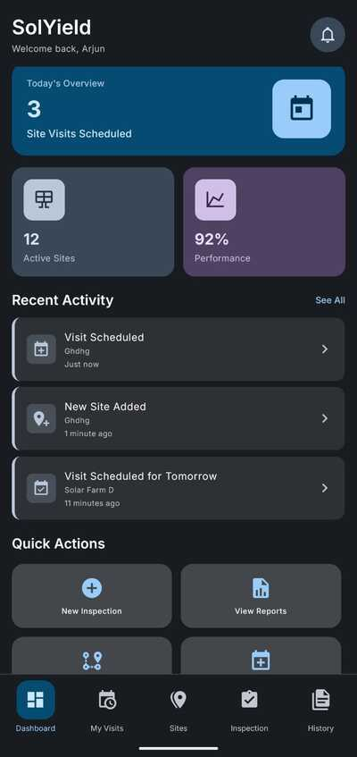
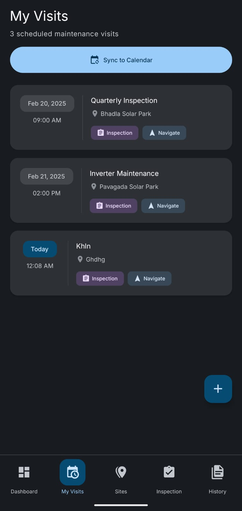
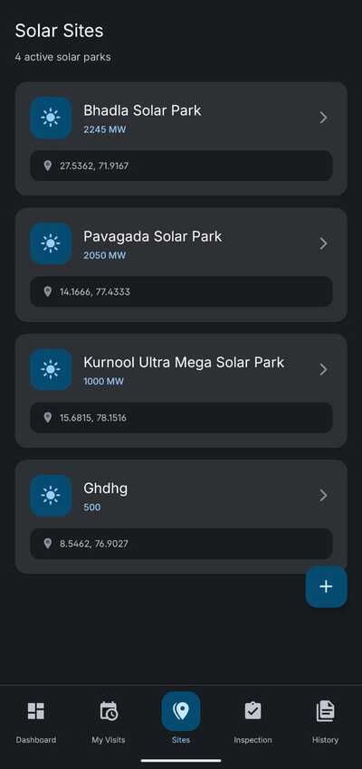
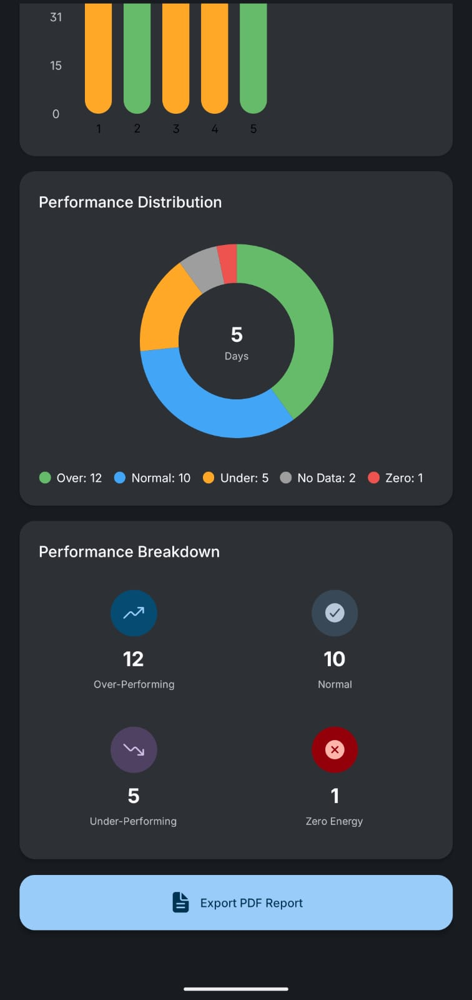
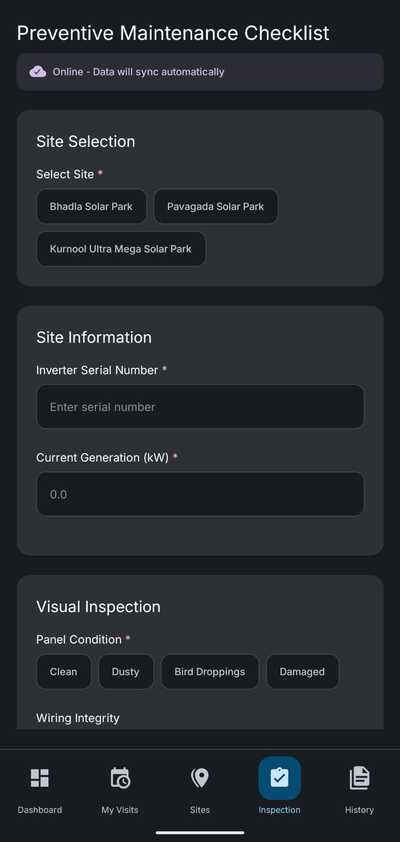

# SolYield Mobile - Solar Farm Management Application

## What Is This App?

SolYield Mobile is a React Native app for **solar field technicians** to manage their daily work. Think of it as a digital toolbox that fits in their pocket:

- **Schedule their day** - See which solar sites they need to visit and when
- **Check in at sites** - Uses GPS to prove they actually visited the location
- **Fill out inspection forms** - Document what they found (with photos!)
- **Generate reports** - Create PDF reports on energy performance
- **Work offline** - All of this works without internet, then syncs when back online

The app is built for technicians who might be in remote areas with spotty cell service - the data they collect stays safe on their phone until they have a connection again.

## Technical Stack

| Category         | Technology                                                                 |
| ---------------- | -------------------------------------------------------------------------- |
| Framework        | React Native with Expo SDK 54                                              |
| Language         | TypeScript (Strict Mode)                                                   |
| State Management | WatermelonDB (Single source of truth)                                      |
| Navigation       | Expo Router (File-based routing)                                           |
| UI Framework     | Material 3 + Material You + NativeWind                                     |
| Offline Database | WatermelonDB                                                               |
| Maps             | react-native-maps                                                          |
| Maps Note        | ⚠️ Android testing pending (requires billing-enabled Google Cloud account) |

> **⚠️ Note on Maps**: The app is configured to use `react-native-maps`, but full testing on Android requires a Google Maps API key with billing enabled. To enable full map functionality:
>
> 1. Create a Google Cloud project with billing enabled
> 2. Enable the Maps SDK for Android
> 3. Generate an API key and add it to `app.json`
>    | Charts | react-native-gifted-charts |
>    | PDF Generation | expo-print |
>    | Calendar | expo-calendar |
>    | Location Services | expo-location |
>    | Camera | expo-camera |

## Architecture Principles

The application follows strict modular architecture principles:

1. **Separation of Concerns**: UI components are isolated from business logic
2. **Single Responsibility**: Each module serves one clear purpose
3. **Dependency Direction**: UI depends on business logic, not vice versa
4. **Pure Functions**: Utilities are stateless and fully testable
5. **Hook Abstraction**: Database complexity hidden behind custom hooks
6. **Offline-First**: All data operations work without network connectivity

### Layer Architecture

```
┌─────────────────────────────────────────┐
│          UI Layer (Presentation)        │
│  - Components (React)                   │
│  - Screens (Pages)                      │
│  - Styling (NativeWind + M3 Tokens)    │
└─────────────────┬───────────────────────┘
                  │ uses
┌─────────────────▼───────────────────────┐
│         Business Logic Layer            │
│  - Custom Hooks (useActivityManager)   │
│  - Utility Functions (activityUtils)   │
│  - Type Definitions                    │
└─────────────────┬───────────────────────┘
                  │ uses
┌─────────────────▼───────────────────────┐
│          Data Layer (State)             │
│  - WatermelonDB (Single Source)        │
│  - Models (Site, Schedule, Activity)   │
│  - Observable Queries                   │
└─────────────────────────────────────────┘
│ - Type Definitions                     │
└─────────────────┬───────────────────────┘
                  │ uses
┌─────────────────▼───────────────────────┐
│ Data Layer (State)                     │
│ - WatermelonDB                           │
│ - Models (Site, Schedule, Activity)      │
└─────────────────────────────────────────┘

```

## Features

Here's what the app can do, organized by what makes sense for the user:

---

### 📅 Scheduling

Technicians need to know where they're going and when. This feature handles all that calendar business:

- **Visit Schedule** - Shows upcoming maintenance visits with date, time, and site details
- **Calendar Sync** - Connects to the phone's native calendar via `expo-calendar` so visits appear alongside personal appointments
- **Custom Date/Time Pickers** - Material You themed pickers for selecting dates and times
- **Requiem Visits** - Special visits that don't belong to a specific site (memorial visits, general site checks)
- **Conflict Prevention** - Won't let technicians book two visits at the same time (with a 5-minute buffer)
- **Auto-Save** - Form data saves automatically as they type, so nothing is lost if they get interrupted

**Key Files**:
- `app/(tabs)/schedule.tsx` - Main schedule screen
- `app/add-visit.tsx` - Form to add new visits
- `app/components/M3DatePicker.tsx` - Calendar-style date picker
- `app/components/M3TimePicker.tsx` - Wheel-style time picker

---

### 🗺️ Sites

Every solar farm is a "site" in the app. This feature shows all sites and their details:

- **Site List** - All solar farms listed with capacity info and location coordinates
- **Mini Map Preview** - Each site card shows a small map (no API key needed)
- **Site Details** - Full page with site info, upcoming visits, and check-in button
- **Navigation** - Deep-links to Google Maps or Apple Maps for turn-by-turn directions
- **Archival** - Old sites can be archived (hidden from the main list but preserved in database)

**Key Files**:
- `app/(tabs)/sites.tsx` - List of all sites
- `app/site/[id].tsx` - Individual site details
- `app/components/maps/MiniMapPreview.tsx` - API-key-free map component
- `app/components/maps/SiteMapWidget.tsx` - Reusable map wrapper

---

### 🏠 Check-In System

When a technician arrives at a site, they need to prove they were there. The check-in system handles this:

**Check-In:**
- Uses GPS to get the technician's current location
- Calculates distance to the site using the Haversine formula (math that figures out distance between two points on Earth)
- Only allows check-in when within **50 meters** of the site
- Automatically links the check-in to any scheduled visit for that day
- Creates an Activity record to track the visit in the activity feed

**Check-Out:**
- The check-in button becomes a check-out button once checked in
- Calculates how long they were at the site (duration)
- Shows duration as "2h 15m" format
- Marks the visit as completed in the database

**Archival:**
After checking out, the app asks if they want to archive:
1. "Archive This Visit?" - Keeps the record but hides it from the main list
2. "Archive This Site?" - Only appears if there are no future visits scheduled

**Technical Details:**
- Uses battery-efficient single-shot GPS requests
- Falls back to last known position if GPS fails
- Stores timestamps in the database: `checked_in_at`, `checked_out_at`, `actual_duration_minutes`

**Key Files**:
- `app/site/[id].tsx` - Site detail with check-in/check-out buttons
- `lib/hooks/useGeofencing.ts` - GPS and distance calculations
- `lib/hooks/useActivityManager.ts` - Creates activity records
- `database/models/Schedule.ts` - Stores check-in/out timestamps

---

### 🗺️ Maps & Navigation

The app shows maps in two ways:

**Mini Map Preview (Default - No API Key Needed):**
- Simple grid-based stylized map showing site location
- Shows a marker where the site is
- Works completely offline
- Used in site cards on the Sites list page

**Full Navigation:**
- When technicians need directions, tapping "Navigate" opens:
  - Google Maps on Android
  - Apple Maps on iOS
- Passes the site coordinates directly to the maps app

**Technical Notes:**
- Originally used a placeholder "expo-maps" package that has been removed
- Now uses `react-native-maps` directly
- The map system is modular - easy to swap implementations
- ⚠️ **Android Testing Note**: Full testing on Android devices requires a Google Maps API key with billing enabled. The code is ready but hasn't been tested on a physical Android device with maps enabled due to the Google Cloud billing requirement.

**Key Files**:
- `app/components/maps/MiniMapPreview.tsx` - Stylized grid map
- `app/components/maps/SiteMapWidget.tsx` - Wrapper component
- `app/components/maps/NativeMapView.tsx` - Full map view
- `app/map-navigation.tsx` - Turn-by-turn navigation screen

Benefits:

- Zero crashes: App works without any API keys
- Modular: Easy to swap to react-native-maps by setting environment variable
- Enhanced UX: Activity cards show rich context with inline maps
- Consistent: All map surfaces use same widget interface
- Future-ready: NativeMapView wrapper ready for real maps integration

---

### 📊 Reports & Analytics

Technicians and managers need to see how solar sites are performing:

**Charts:**

- **Bar Chart** - Shows daily energy generation (kWh) for each day of the month
- **Pie Chart** - Shows performance breakdown:
  - Over-performing days (generating more than expected)
  - Normal days
  - Under-performing days
  - Zero energy days (no generation)
- **Stats Cards** - Quick numbers: Average, Peak, and Total kWh

**PDF Export:**

- Generate a PDF report of the performance data
- Share via email, messaging apps, or save to files
- Uses `expo-print` for PDF generation

**Key Files**:

- `app/performance.tsx` - Main analytics screen
- `lib/utils/chartHelpers.ts` - Transforms raw data into chart-friendly format

---

## 💾 Offline Mode

The app is built to work without internet. Here's how:

### Local Data Storage

All data lives in **WatermelonDB** - an offline-first database that stores data right on the phone:

- **Sites** - All site information stored locally
- **Schedules** - Visit schedules persist without internet
- **Activities** - Activity log stays on device
- **Inspection Forms** - Filled forms save locally

### Background Sync

When the phone gets internet back:

- App detects network status automatically
- Queues up any unsynced data
- Syncs in the background (every 10 minutes)
- Shows sync status in the UI

### Archival System

To keep things organized, the app has an archival system:

**Visit Archival:**

- After checking out, technicians can archive the visit
- Archived visits hide from the main list but stay in database

**Site Archival:**

- Sites can be archived when no future visits are scheduled
- **Cascade Effect**: Archiving a site also archives:
  - All activities for that site
  - All schedules for that site
  - All inspection forms for that site

**Database Fields:**

- `sites.archived` - Is the site archived?
- `sites.archivedAt` - When was it archived?
- `schedules.archived` - Is the visit archived?
- `activities.archived` - Is the activity archived?

**Key Files**:

- `lib/hooks/useOfflineSync.ts` - Handles background sync
- `database/schema.ts` - Database structure
- `database/models/Site.ts` - Site model with archival methods
- `lib/hooks/useSites.ts` - Queries that filter out archived items

---

### 📝 Inspection Forms

When technicians visit a site, they often need to document what they found. The inspection form handles this:

**Form Features:**

- **Dynamic Fields** - Different field types:
  - Text boxes for notes
  - Number inputs for measurements
  - Dropdowns for predefined options
  - Radio buttons for yes/no
  - Checkboxes for multiple selections
  - File uploads for photos
- **Validation** - Required fields won't let them submit empty
- **Site Selection** - Links form to a specific site

**Key Files**:

- `app/(tabs)/inspections.tsx` - List of completed inspections
- `app/inspection-form.tsx` - The form itself
- `lib/hooks/useInspections.ts` - Form management logic
- `lib/hooks/useMaintenanceForm.ts` - Database operations for forms

---

### 📸 Camera & Photos

Technicians need to take photos as evidence:

- **Take Photo** - Uses phone camera via `expo-camera`
- **Choose from Gallery** - Pick existing photos via `expo-image-picker`
- **Preview** - See photos before submitting
- **Multiple Photos** - Can attach several photos to one form

Photos are stored as URIs in the database and persist offline.

---

### 🔄 Sync System

The app is smart about syncing:

- **Network Detection** - Uses `@react-native-community/netinfo` to know when online/offline
- **Status Banner** - Shows "Offline" or "Syncing" in the UI
- **Manual Refresh** - Pull-to-refresh to force sync
- **Retry Logic** - If sync fails, tries again automatically

**Key Files**:

- `lib/hooks/useOfflineSync.ts` - Main sync logic
- `lib/hooks/useMaintenanceForm.ts` - Form sync operations

---

## 🎨 Design System

The app uses Material You (Material Design 3) for a modern, consistent look:

### Material You Dynamic Colors

The app dynamically picks colors from the phone's wallpaper:

- **Android 12+** - Extracts colors from wallpaper for a personalized look
- **iOS & Older Android** - Falls back to a green "solar energy" color palette
- **Light/Dark Mode** - Automatically matches system settings

### Custom M3 Components

The app includes reusable components following Material 3 guidelines:

- **M3DatePicker** - Calendar grid for picking dates
- **M3TimePicker** - Wheel picker for times
- **M3ErrorDialog** - Styled error messages
- **M3ConfirmDialog** - Yes/No confirmation dialogs
- **ActivityCard** - Activity feed items with icons and colors
- **StyledText** - Typography component

**Key Files**:

- `lib/hooks/MaterialYouProvider.tsx` - Global color provider
- `lib/design/tokens.ts` - Design token definitions
- `lib/design/colorRoles.ts` - Semantic color mapping

  return (
  <View style={{ backgroundColor: colors.appBackground }}>
  <View style={{ backgroundColor: colors.surfaceBase }}>
  <Text style={{ color: colors.textPrimary }}>Hello</Text>
  </View>
  </View>
  );
  }

```

#### M3 Design Tokens

- Typography system (Display, Headline, Title, Body, Label variants)
- Elevation system (Level 0-5 with Material shadows)
- Shape system (Rounded corner specifications)
- Motion system (Duration and easing functions)
- Spacing system (Consistent padding/margin scale)

**Key Files**:

- `lib/design/tokens.ts` - M3 design token definitions
- `lib/styles/m3.ts` - StyleSheet-based M3 implementations

#### Custom M3 Components

- M3DatePicker: Calendar grid with month/year navigation
- M3TimePicker: Hour/minute wheel picker with AM/PM toggle
- M3ErrorDialog: Validation dialog (error/warning/info/success types)
- M3AlertDialog: Generic alert dialog
- M3ConfirmDialog: Multi-button confirmation dialog
- ActivityCard: Activity display with Material You theming
- StyledText: Typography component with M3 variants

**Key Files**:

- `app/components/M3DatePicker.tsx`
- `app/components/M3TimePicker.tsx`
- `app/components/M3ErrorDialog.tsx`
- `app/components/M3AlertDialog.tsx`
- `app/components/M3ConfirmDialog.tsx`
- `app/components/ActivityCard.tsx`
- `app/components/StyledText.tsx`

## Project Structure

```
```
SolYield/
├── app/ # Expo Router pages
│ ├── (tabs)/ # Bottom tab navigation
│ │ ├── index.tsx # Dashboard/Home screen
│ │ ├── schedule.tsx # Visit schedule
│ │ ├── sites.tsx # Solar Sites list
│ │ ├── inspections.tsx # Inspections list
│ │ └── \_layout.tsx # Tab bar layout
│ ├── components/ # Reusable UI components
│ │ ├── maps/ # Map system
│ │ │ ├── MiniMapPreview.tsx # Stylized grid map
│ │ │ ├── SiteMapWidget.tsx # Map wrapper
│ │ │ └── NativeMapView.tsx # Full map view
│ │ ├── M3DatePicker.tsx # Material date picker
│ │ ├── M3TimePicker.tsx # Material time picker
│ │ ├── M3ErrorDialog.tsx # Error dialog
│ │ ├── ActivityCard.tsx # Activity display card
│ │ └── StyledText.tsx # Typography wrapper
│ ├── site/[id].tsx # Site details
│ ├── inspection/[id].tsx # Inspection detail
│ ├── inspection-form.tsx # New inspection form
│ ├── performance.tsx # Charts & PDF export
│ ├── map-navigation.tsx # GPS navigation
│ ├── activities.tsx # Activity feed
│ ├── add-visit.tsx # Add visit form
│ ├── add-site.tsx # Add site form
│ └── \_layout.tsx # Root layout
├── store/ # DEPRECATED - kept for compatibility
│ └── index.ts # Empty Redux config (unused)
├── database/ # WatermelonDB
│ ├── models/ # Data models
│ │ ├── Site.ts # Site model
│ │ ├── Schedule.ts # Schedule model
│ │ ├── Activity.ts # Activity model
│ │ ├── MaintenanceForm.ts # Inspection form model
│ │ └── FormPhoto.ts # Photo model
│ ├── schema.ts # Database schema
│ ├── migrations.ts # Database migrations
│ └── index.ts # Database setup
├── lib/ # Business logic
│ ├── hooks/ # Custom React hooks
│ │ ├── MaterialYouProvider.tsx # Color theme provider
│ │ ├── useActivityManager.ts # Activity CRUD
│ │ ├── useMaintenanceForm.ts # Form CRUD
│ │ ├── useInspections.ts # Inspection hooks
│ │ ├── useOfflineSync.ts # Background sync
│ │ ├── useGeofencing.ts # GPS & distance
│ │ ├── useSiteManagement.ts # Site operations
│ │ └── useScheduleManagement.ts # Visit operations
│ ├── utils/ # Helper functions
│ │ ├── activityUtils.ts # Activity helpers
│ │ ├── dateFormatter.ts # Date formatting
│ │ ├── locationUtils.ts # GPS calculations
│ │ └── chartHelpers.ts # Chart data
│ ├── design/ # Design system
│ │ ├── tokens.ts # M3 tokens
│ │ └── colorRoles.ts # Color mapping
│ └── config/ # Configuration
│ └── maps.ts # Map settings
├── assets/ # Images & icons
├── form_schema.ts # Inspection form definition
└── package.json # Dependencies

```
```
├── form_schema.js # Dynamic form schema
├── schedule.js # Sample schedule data
├── sites.js # Sample site data
├── chart_data.js # Sample chart data
├── performance_data.js # Sample performance data
└── package.json # Dependencies

```

## Installation & Setup

### Prerequisites

- Node.js 18 or higher
- npm or yarn package manager
- Expo CLI
- Android Studio (for Android development)
- Xcode (for iOS development, macOS only)
- Physical Android 12+ device (recommended for Material You testing)

### Installation Steps

```bash
# Clone the repository
git clone <repository-url>
cd Sol/SolYield

# Install dependencies
npm install

# Start development server
npm start

# Run on Android (requires connected device or emulator)
npm run android

# Run on iOS (requires macOS and Xcode)
npm run ios

# Alternative: Use Expo CLI directly
npx expo run:android
npx expo run:ios
```

### Environment Configuration

The application works out-of-the-box without any API keys. To enable native maps in the future:

1. Set environment variable in `.env`:

```env
EXPO_PUBLIC_ENABLE_NATIVE_MAPS=true
```

2. Add Google Maps API key to `app.json`:

```json
{
  "android": {
    "config": {
      "googleMaps": {
        "apiKey": "YOUR_GOOGLE_MAPS_API_KEY"
      }
    }
  }
}
```

## Development Commands

```bash
# Start development server
npm start

# Run on Android device/emulator
npm run android

# Run on iOS device/simulator (macOS only)
npm run ios

# Run TypeScript type checking
npm run type-check

# Run ESLint
npm run lint

# Run Prettier formatter
npm run format

# Clear cache and restart
npm start --clear
```

## Production Build & Deployment

### Prerequisites for Production Builds

1. **Install EAS CLI globally:**

```bash
npm install -g eas-cli
```

2. **Login to Expo account:**

```bash
eas login
```

3. **Configure project (first time only):**

```bash
eas build:configure
```

### Building for Production

#### Option 1: EAS Build (Recommended - Cloud-Based)

EAS Build compiles your app in the cloud without requiring local Android Studio or Xcode setup.

**Build APK for Android:**

```bash
npm run build:android
# or directly:
eas build --platform android --profile production
```

**Build for iOS:**

```bash
npm run build:ios
# or directly:
eas build --platform ios --profile production
```

**Build for Both Platforms:**

```bash
npm run build:all
# or directly:
eas build --platform all --profile production
```

**Check Build Status:**

```bash
eas build:list
```

**Download Build:**
After build completes, EAS will provide a download link. You can also download from:

```bash
eas build:view <build-id>
```

#### Option 2: Local Build (Requires Android Studio/Xcode)

**Android Release APK (Local):**

```bash
npm run android:build
# This runs: cd android && ./gradlew clean && ./gradlew assembleRelease
# Output: android/app/build/outputs/apk/release/app-release.apk
```

**Android Release AAB (Local - for Google Play):**

```bash
npm run android:bundle
# This runs: cd android && ./gradlew clean && ./gradlew bundleRelease
# Output: android/app/build/outputs/bundle/release/app-release.aab
```

**iOS Release (Local - macOS only):**

```bash
npm run ios:release
# This runs: expo run:ios --configuration Release
```

### Build Profiles (Configured in eas.json)

The project includes three build profiles:

1. **development**: Development client with fast refresh
   - Output: APK (Android)
   - Distribution: Internal testing

2. **preview**: Pre-production testing build
   - Output: APK (Android)
   - Distribution: Internal testing

3. **production**: Final production build
   - Output: APK (Android) or AAB (for Google Play)
   - Environment: NODE_ENV=production
   - Console logs automatically removed via metro.config.js

### Converting AAB to APK

Google Play Store requires AAB (Android App Bundle) format, but for direct distribution you may need APK. Here's how to convert:

#### Method 1: Using bundletool (Official Google Tool)

**1. Download bundletool:**

```bash
wget https://github.com/google/bundletool/releases/latest/download/bundletool-all-1.15.6.jar
# Or download manually from: https://github.com/google/bundletool/releases
```

**2. Generate APKs from AAB:**

```bash
java -jar bundletool-all-1.15.6.jar build-apks \
  --bundle=app-release.aab \
  --output=app-release.apks \
  --mode=universal
```

**3. Extract Universal APK:**

```bash
unzip app-release.apks -d output/
# The universal APK will be in: output/universal.apk
```

**4. Rename and use:**

```bash
mv output/universal.apk SolYield-v1.3.0.apk
```

#### Method 2: Using bundletool with Device Signature (Recommended for Testing)

**1. Generate signed APKs for a specific device:**

```bash
# Create debug keystore if you don't have one
keytool -genkey -v -keystore debug.keystore \
  -alias androiddebugkey \
  -keyalg RSA -keysize 2048 -validity 10000 \
  -storepass android -keypass android

# Build APK set
java -jar bundletool-all-1.15.6.jar build-apks \
  --bundle=app-release.aab \
  --output=app-release.apks \
  --ks=debug.keystore \
  --ks-pass=pass:android \
  --ks-key-alias=androiddebugkey \
  --key-pass=pass:android
```

**2. Install directly to connected device:**

```bash
java -jar bundletool-all-1.15.6.jar install-apks \
  --apks=app-release.apks
```

#### Method 3: Online Conversion (Quick but Less Secure)

For quick testing, you can use online tools (use with caution for production builds):

- https://aab-to-apk.com/
- https://www.apkconverter.com/

**Note:** Only use online converters for testing builds, never for production releases containing sensitive code or API keys.

### Build Configuration Details

**app.json (Production Settings):**

- Version: 1.3.0
- Bundle Identifier: com.solyield.mobile
- Adaptive Icon: Configured for Android
- Permissions: All required permissions defined

**metro.config.js (Production Optimizations):**

- `drop_console: true` - Removes all console.log statements in production
- Minification enabled automatically

**tsconfig.json:**

- Strict mode enabled
- Current status: **✅ Zero TypeScript errors**

### Pre-Build Checklist

Before building for production, run:

```bash
npm run prebuild
# This runs: npm run type-check && npm run lint
```

**Current Status:**

- ✅ TypeScript: 0 errors (strict mode)
- ⚠️ ESLint: Migration to v10 needed (non-blocking)

### Deployment to App Stores

#### Google Play Store (Android)

1. **Build AAB:**

```bash
eas build --platform android --profile production
```

2. **Submit to Google Play:**

```bash
eas submit --platform android
```

3. **Manual Upload:**

- Go to: https://play.google.com/console
- Create app listing
- Upload AAB file
- Fill in store listing details
- Submit for review

#### Apple App Store (iOS)

1. **Build IPA:**

```bash
eas build --platform ios --profile production
```

2. **Submit to App Store:**

```bash
eas submit --platform ios
```

3. **Manual Upload:**

- Open Xcode
- Use Transporter app to upload IPA
- Complete App Store Connect listing
- Submit for review

### Version Management

Update version before each build:

**1. Update package.json:**

```json
{
  "version": "1.4.0"
}
```

**2. Update app.json:**

```json
{
  "expo": {
    "version": "1.4.0",
    "android": {
      "versionCode": 4
    },
    "ios": {
      "buildNumber": "4"
    }
  }
}
```

**Note:**

- `version` is the user-facing version string (e.g., "1.4.0")
- `versionCode` (Android) must be an integer that increments with each release
- `buildNumber` (iOS) must be a string that increments with each release

### Testing Production Builds

**1. Test APK locally:**

```bash
# Install on connected device
adb install app-release.apk

# Or use EAS
eas build:run --platform android
```

**2. Verify production features:**

- Check that console.log statements are removed
- Verify Material You dynamic colors work
- Test offline functionality (airplane mode)
- Test geofencing check-in/check-out
- Test archival workflow
- Verify all permissions work
- Test database migrations (v3 → v4)

**3. Performance testing:**

- Monitor app size (target: < 50MB)
- Check startup time (target: < 3 seconds)
- Test on low-end Android devices
- Verify smooth 60fps chart animations

### Troubleshooting Production Builds

**Build fails with "Could not find bundletool":**

```bash
# Install bundletool
npm install -g @android/bundletool
```

**APK won't install on device:**

```bash
# Uninstall old version first
adb uninstall com.solyield.mobile

# Then reinstall
adb install app-release.apk
```

**Material You colors not working:**

- Ensure testing on Android 12+ device
- Check that device wallpaper is set
- Verify app has permission to read wallpaper colors

**Database migration errors:**

- Clear app data before installing new version
- Or implement proper migration testing in pre-release

### Build Artifacts Location

**EAS Builds (Cloud):**

- Download from EAS dashboard: https://expo.dev
- Or use CLI: `eas build:list`

**Local Builds:**

- Android APK: `android/app/build/outputs/apk/release/app-release.apk`
- Android AAB: `android/app/build/outputs/bundle/release/app-release.aab`
- iOS IPA: Built via Xcode or `eas build`

## Testing

### Material You Testing

To test the Material You dynamic color system:

1. Run the app on an Android 12+ device
2. Change your device wallpaper
3. Verify app colors update to match wallpaper palette
4. Toggle between light and dark mode in system settings
5. Verify proper color adaptation

### Offline Testing

To test offline functionality:

1. Fill out an inspection form
2. Enable airplane mode on the device
3. Submit the form (should save locally)
4. Close and reopen the app
5. Verify form persisted
6. Disable airplane mode
7. Verify automatic sync indicator

### Geofencing Testing

To test geofencing:

1. Navigate to a site detail screen
2. Observe your current distance from the site
3. Move closer than 50 meters to the site
4. Verify "Check In" button becomes enabled
5. Tap "Check In" to log your arrival

## Key Technical Highlights

### Performance Optimizations

The app has been tuned for smooth performance:

- **GPS Battery Optimization** - Changed from 5-second/10-meter intervals to 15-second/50-meter intervals. Uses single-shot requests instead of continuous tracking
- **Pre-calculated Metadata** - Visit counts and last visit timestamps are calculated once when creating activities, not on every render (O(1) reads instead of O(n))
- **FlatList Tuning** - Increased batch sizes (`initialNumToRender: 8`, `maxToRenderPerBatch: 8`) for smoother scrolling
- **Component Memoization** - Used `useCallback` and `React.memo` to prevent unnecessary re-renders
- **NativeWind Migration** - Replaced StyleSheet with Tailwind CSS classes for better performance
- **Single-Shot Location** - GPS gets position once with fallback to last known position, no GPS spinning

### Offline-First Architecture

- **WatermelonDB** - Single source of truth, no Redux
- **Observable Queries** - Data updates automatically when database changes
- **Network Detection** - Uses `@react-native-community/netinfo` to detect online/offline status
- **Background Sync** - Automatically syncs every 10 minutes when online
- **No Dual State** - Eliminated memory bloat from having both Redux and WatermelonDB

### TypeScript Strict Mode

- Full type coverage across entire codebase
- Zero `any` types (except necessary third-party interop)
- Strict null checks enabled
- Interface-based contracts for all data models

### What Changed in v1.4.0

| Change           | Before                  | After                   |
| ---------------- | ----------------------- | ----------------------- |
| State Management | Redux + WatermelonDB    | WatermelonDB only       |
| GPS Interval     | 5 seconds               | 15 seconds              |
| GPS Distance     | 10 meters               | 50 meters               |
| FlatList Batches | 5                       | 8                       |
| Map Package      | expo-maps (placeholder) | react-native-maps       |
| Keep Awake       | Causing errors          | Blocked via resolutions |

### Accessibility

- Pastel color palette for reduced eye strain
- High contrast text (WCAG AA compliant)
- Touch target sizes minimum 48dp
- Screen reader compatible labels
- Semantic HTML equivalents in React Native

## Screenshots

|                   Dashboard                    |                   Schedule                   |                 Sites                  |                    Performance                     |                    Inspection                    |
| :--------------------------------------------: | :------------------------------------------: | :------------------------------------: | :------------------------------------------------: | :----------------------------------------------: |
|  |  |  |  |  |

### Feature Highlights

| Feature            | Description                                                                                                                                                                   |
| ------------------ | ----------------------------------------------------------------------------------------------------------------------------------------------------------------------------- |
| Dashboard          | Material You themed home screen with dynamic colors, quick stats overview, recent activity feed, offline/online status indicator, and user profile icon                       |
| Schedule           | Scheduled maintenance visits list with custom date/time pickers, calendar sync, conflict validation, requiem visit support, and check-in/out tracking                         |
| Sites              | Interactive modular map with solar site markers, site list view with mini map previews, navigation integration, and archival system                                           |
| Check-in/Check-out | Real-time GPS tracking, 50m geofence validation, automatic visit duration calculation, activity logging, and linked schedule updates                                          |
| Archival System    | Smart visit archival after check-out, site archival when no future visits exist, cascade archival of related data, and filtered queries                                       |
| GPS Navigation     | Real-time location tracking, distance and ETA display, geofencing validation, and external navigation deep-links                                                              |
| Performance        | Bar chart for daily energy generation, pie chart for performance breakdown, stats cards (Average/Peak/Total kWh), and PDF export with sharing                                 |
| Inspection         | Dynamic form rendering from schema, site selection, multiple field types (text/number/dropdown/radio/checkbox/file), camera capture, offline status banner, and sync tracking |
| Inspection History | List of submitted inspections, sync status badges (Synced/Pending), form detail view, and image gallery support                                                               |

## Known Limitations

1. **Static Performance Data**: Performance analytics currently displays sample data from `performance_data.js`. Integration with real-time energy monitoring systems is planned for future releases.

2. **WatermelonDB Sync**: Sync-on-reconnect functionality is implemented with local state management. Full cloud sync with backend API requires server-side implementation.

3. **iOS Material You**: Dynamic color extraction is Android 12+ only. iOS and older Android versions fall back to a static green energy palette.

4. **Google Maps on Android**: The app is configured for `react-native-maps` but hasn't been tested on physical Android devices because Google Maps SDK requires a billing-enabled Google Cloud account. The code is ready - you just need to:
   - Create a Google Cloud project
   - Enable billing (credit card required)
   - Enable Maps SDK for Android
   - Generate an API key
   - Add the key to `app.json`

   The app will work on iOS with Apple Maps without any additional setup.

## Future Enhancements

- Real-time performance data integration with solar monitoring APIs
- Backend API integration for multi-user sync
- Push notifications for scheduled visits
- Advanced analytics with trend predictions
- Multi-language support
- Biometric authentication
- Export data to CSV/Excel formats
- Unit and integration test suite
- **Google Maps API Integration**: Full Android testing with Google Maps SDK (requires Google Cloud billing setup)

## License

This project is proprietary. All rights reserved by SolYield. Unauthorized copying, distribution, or use is prohibited. See hackathon terms and conditions in `AGENTS.md`.

## Support

For technical questions or issues, contact the development team via the hackathon submission portal.

## Acknowledgments

Built for the SolYield Mobile Migration Hackathon. Implements industry-standard libraries and follows React Native best practices as specified in the hackathon requirements.

### Core Technologies

- React Native Team - Framework and core libraries
- Expo Team - Managed workflow and developer tools
- Nozbe - WatermelonDB offline-first database
- Material Design Team - Design system guidelines

### Third-Party Libraries

- react-native-maps - Map rendering
- react-native-gifted-charts - High-performance chart rendering
- react-native-material-you-colors - Dynamic color extraction
- react-native-reanimated - Smooth animations
- expo-print - PDF generation capabilities
- expo-camera - Camera integration
- expo-location - GPS and geofencing

---

## 🛣️ Milestones (Development Journey)

Think of these like highway mile markers - they show how far we've come:

```
╔═══════════════════════════════════════════════════════════════════╗
║  🚗  MILE 0: THE START                                          ║
║  Basic app structure with scheduling and site management          ║
║  → See: Scheduling, Sites                                        ║
╠═══════════════════════════════════════════════════════════════════╣
║  🛣️  MILE 25: GETTING CONNECTED                                ║
║  Features that work better with internet                         ║
║  → See: Check-In System, Reports & Analytics                    ║
╠═══════════════════════════════════════════════════════════════════╣
║  🏔️  MILE 50: GOING OFF-ROAD                                   ║
║  Full offline capability - work anywhere                        ║
║  → See: Offline Mode, Inspection Forms, Camera & Photos          ║
╠═══════════════════════════════════════════════════════════════════╣
║  🎨  MILE 75: THE BEAUTIFUL JOURNEY                             ║
║  Material You design with dynamic colors                        ║
║  → See: Design System                                            ║
╠═══════════════════════════════════════════════════════════════════╣
║  🔧  MILE 100: THE TUNE-UP                                      ║
║  Performance optimizations and bug fixes                        ║
║  → See: Performance Optimizations, What's New in v1.4.0         ║
╠═══════════════════════════════════════════════════════════════════╣
║  🌟  MILE 110: PRODUCTION READY                                 ║
║  Current state - all systems operational                        ║
║  → See: Version History                                          ║
╚═══════════════════════════════════════════════════════════════════╝
```

### What Each Milestone Means

**🚗 Mile 0: The Start**
The foundation of the app. Technicians can see their scheduled visits and browse solar sites. This is the baseline - everything else builds on top of this.

**🛣️ Mile 25: Getting Connected**
Features that work best with internet (but have offline fallbacks). The check-in system uses GPS to prove technicians were at sites. Reports and analytics let managers see performance data.

**🏔️ Mile 50: Going Off-Road**
The app now works completely offline. All data is stored locally in WatermelonDB. Technicians can fill out inspection forms with photos in the middle of nowhere. When they get signal again, everything syncs automatically.

**🎨 Mile 75: The Beautiful Journey**
Material You dynamic colors make the app feel native to each user's phone. The interface adapts to their wallpaper and theme preferences.

**🔧 Mile 100: The Tune-Up**
Performance optimizations and bug fixes. GPS battery optimization, pre-calculated data, FlatList tuning - all the invisible improvements that make the app feel smooth.

**🌟 Mile 110: Production Ready**
The current state. All features working together. Ready for real technicians to use in the field.

## Version History

Current Version: 1.4.0

### Recent Updates

**Version 1.4.0** (Current - Production Ready)

This version focused on performance optimizations and bug fixes:

- ✅ **Complete State Migration**:
  - Removed Redux as the primary state management
  - WatermelonDB is now the single source of truth
  - Removed Redux Provider and PersistGate from app layout
  - Deleted all Redux slices (activitySlice, maintenanceSlice, siteSlice, scheduleSlice)
  - All data operations now go directly through WatermelonDB hooks

- ✅ **GPS Battery Optimization**:
  - Changed location polling from 5 seconds / 10 meters to 15 seconds / 50 meters
  - Single-shot GPS requests instead of continuous tracking
  - Falls back to last known position if GPS fails
  - Significant battery savings for technicians in the field

- ✅ **Pre-calculated Metadata**:
  - When creating activities, now calculates previous visit count upfront
  - Stores `previousVisitCount` and `lastVisitTimestamp` in activity metadata
  - Eliminates O(n) calculations on every render - now O(1) reads

- ✅ **FlatList Optimizations**:
  - Increased `initialNumToRender` from 5 to 8
  - Increased `maxToRenderPerBatch` from 5 to 8
  - Smoother scrolling on large lists

- ✅ **Component Memoization**:
  - Added `useCallback` to render functions in schedule, sites, activities screens
  - Added `React.memo` to ActivityCard component
  - Prevents unnecessary re-renders

- ✅ **NativeWind Migration**:
  - Replaced StyleSheet with Tailwind CSS classes in ActivityCard
  - Better performance by moving style calculations to native thread

- ✅ **Runtime Error Fixes**:
  - Added `resolutions` in package.json to block expo-keep-awake (was causing errors)
  - Fixed corrupted useGeofencing.ts file (had recursive UI component)
  - Recreated corrupted MaintenanceForm model

- ✅ **Map System Cleanup**:
  - Removed unused expo-maps dependency (was placeholder)
  - Now uses react-native-maps exclusively
  - Cleaner dependency tree

- ✅ **Removed Mock Data**:
  - Eliminated auto-generated sample activities
  - Prevents "production data leaks" with fake data

- ✅ **New Database Fields**:
  - Added `activityId` field to MaintenanceForm (links forms to activities)
  - Added `images` field for additional photos beyond site photo
  - Added `status` and `isRequiem` fields to ScheduleVisit type

**Version 1.3.0** (Previous)

- ✅ **Check-in/Check-out System**: Complete implementation with geofence validation
  - Links check-in to scheduled visits automatically
  - Calculates actual visit duration (displayed as "Xh Ym")
  - Creates Activity records for tracking
  - Updates Schedule model with check-in/out timestamps and activity ID
- ✅ **Archival System**: Intelligent visit and site archival workflow
  - "Archive This Visit?" dialog after check-out
  - "Archive This Site?" dialog when no future visits exist
  - Cascade archival of all related data (activities, schedules, forms)
  - Filtered queries exclude archived items by default
  - Separate hooks for viewing archived data
- ✅ **Database Migration v3 → v4**: Added check-in/out tracking fields
  - `schedules.checked_in_at` (timestamp)
  - `schedules.checked_out_at` (timestamp)
  - `schedules.actual_duration_minutes` (number)
  - `schedules.activity_id` (string)
- ✅ **Activity Management Overhaul**:
  - Activities now generate and return IDs for linking to schedules
  - Fixed TypeScript errors across useActivities, useInspections
- ✅ **All Alert.alert Replaced**: Consistent M3ErrorDialog usage throughout app
- ✅ **Zero TypeScript Errors**: Full type safety in strict mode
- ✅ **Production Build Ready**: EAS configuration verified
- Added M3ErrorDialog for validation errors (replacing Alert.alert)
- Fixed M3ErrorDialog onDismiss prop to be optional
- Fixed schedule conflict validation with 5-minute buffer
- Improved form state preservation with AsyncStorage auto-save (500ms debounce)
- Enhanced ActivityCard component verified clickable with proper navigation

**Version 1.2.0**

- Modular map system with API-key-free implementation
- Enhanced activity cards with contextual information
- Mini map previews in sites list

**Version 1.1.0**

- Material You dynamic colors system
- Full light/dark mode support
- StatusBar and NavigationBar theming

**Version 1.0.0**

- Initial MVP release with core scheduling, sites, and offline features

---

## 🛣️ Milestones (Development Journey)

Think of these like highway mile markers - they show how far we've come:

```
╔═══════════════════════════════════════════════════════════════════════╗
║  🚗  MILE 0: THE START                                             ║
║  Basic app structure with scheduling and site management            ║
║  → See: Scheduling, Sites                                         ║
╠═══════════════════════════════════════════════════════════════════════╣
║  🛣️  MILE 25: GETTING CONNECTED                                   ║
║  Features that work better with internet                           ║
║  → See: Check-In System, Reports & Analytics                     ║
╠═══════════════════════════════════════════════════════════════════════╣
║  🏔️  MILE 50: GOING OFF-ROAD                                     ║
║  Full offline capability - work anywhere                          ║
║  → See: Offline Mode, Inspection Forms, Camera & Photos           ║
╠═══════════════════════════════════════════════════════════════════════╣
║  🎨  MILE 75: THE BEAUTIFUL JOURNEY                               ║
║  Material You design with dynamic colors                          ║
║  → See: Design System                                             ║
╠═══════════════════════════════════════════════════════════════════════╣
║  🔧  MILE 100: THE TUNE-UP                                        ║
║  Performance optimizations and bug fixes                          ║
║  → See: Performance Optimizations, What's New in v1.4.0           ║
╠═══════════════════════════════════════════════════════════════════════╣
║  🌟  MILE 110: PRODUCTION READY                                    ║
║  Current state - all systems operational                         ║
║  → See: Version History                                           ║
╚═══════════════════════════════════════════════════════════════════════╝
```

### What Each Milestone Means

**🚗 Mile 0: The Start**
The foundation of the app. Technicians can see their scheduled visits and browse solar sites. This is the baseline - everything else builds on top of this.

**🛣️ Mile 25: Getting Connected**
Features that work best with internet (but have offline fallbacks). The check-in system uses GPS to prove technicians were at sites. Reports and analytics let managers see performance data.

**🏔️ Mile 50: Going Off-Road**
The app now works completely offline. All data is stored locally in WatermelonDB. Technicians can fill out inspection forms with photos in the middle of nowhere. When they get signal again, everything syncs automatically.

**🎨 Mile 75: The Beautiful Journey**
Material You dynamic colors make the app feel native to each user's phone. The interface adapts to their wallpaper and theme preferences.

**🔧 Mile 100: The Tune-Up**
Performance optimizations and bug fixes. GPS battery optimization, pre-calculated data, FlatList tuning - all the invisible improvements that make the app feel smooth.

**🌟 Mile 110: Production Ready**
The current state. All features working together. Ready for real technicians to use in the field.
